# 🏗️ Web Scraper - Architecture & Process Flow Diagrams

## 📊 System Architecture

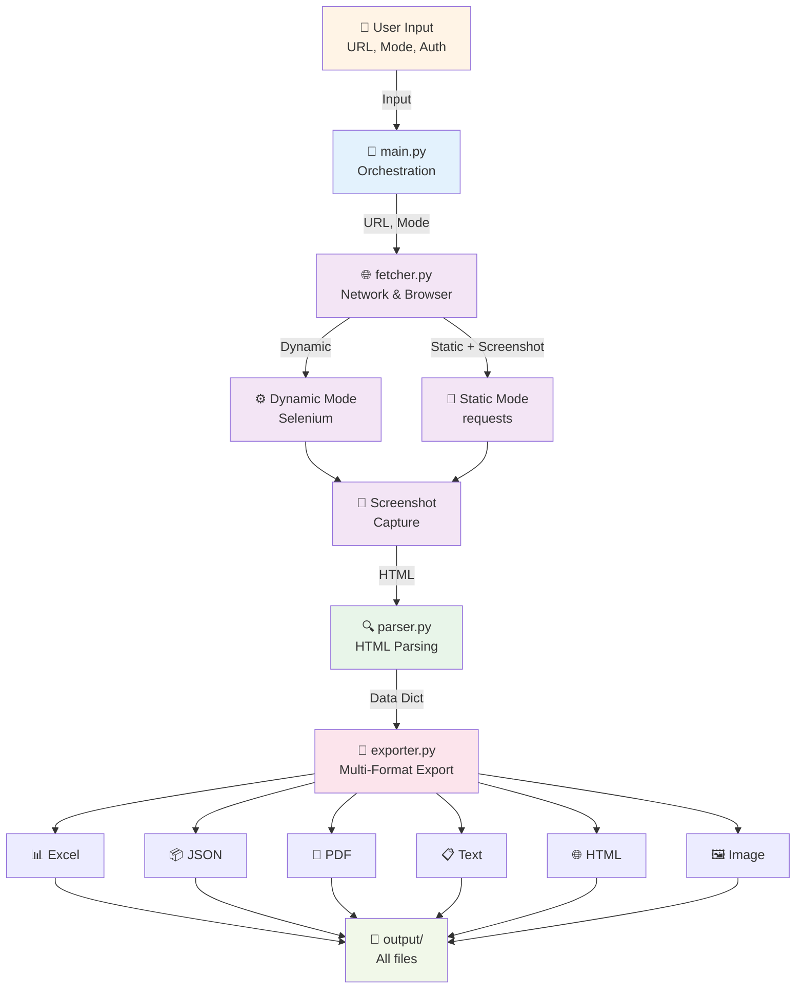

---

## 🔄 Complete Workflow Process

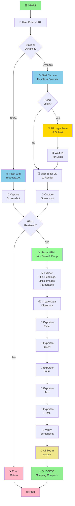

---

## 🌐 Static Mode Detailed Flow

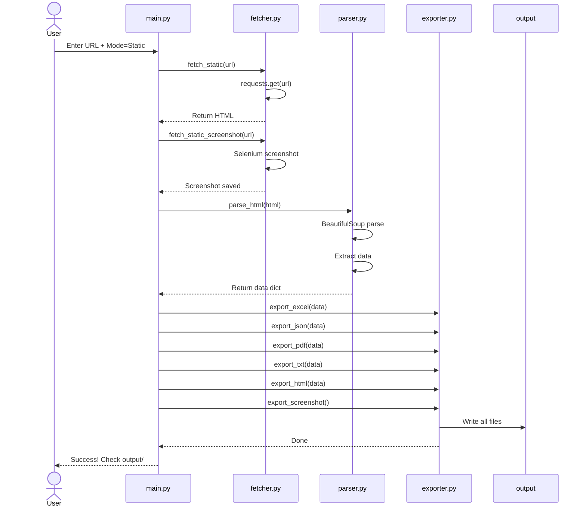

---

## ⚙️ Dynamic Mode Detailed Flow (with Authentication)

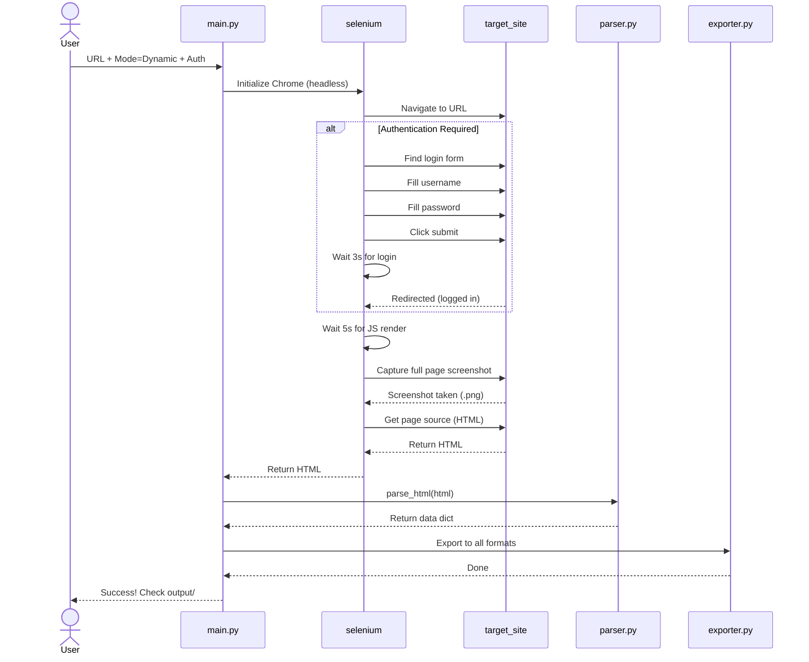

---

## 📊 Data Transformation Pipeline

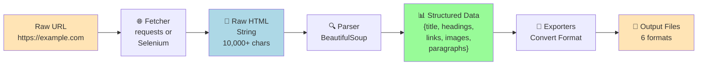

---

## 🔀 Module Interaction Map

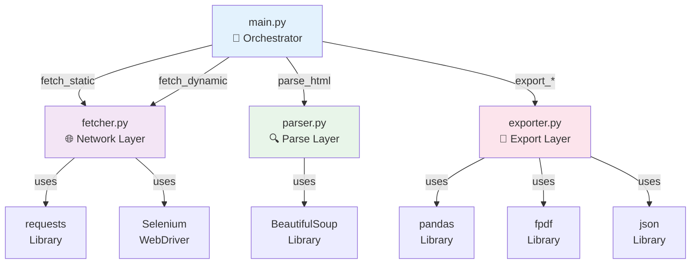

---

## 🔗 Error Handling Zones

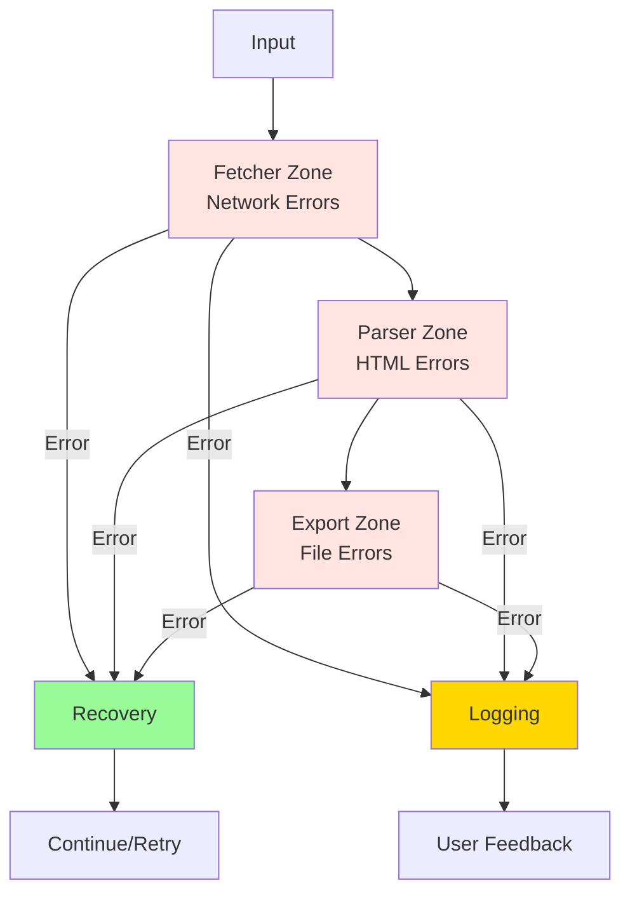

---

## ⏱️ Performance Timeline

### Static Mode (Fast Path)

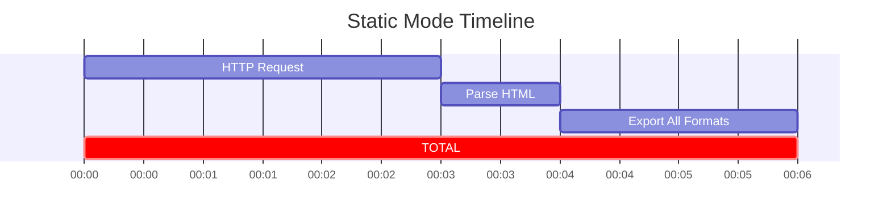

### Dynamic Mode (Slow Path)

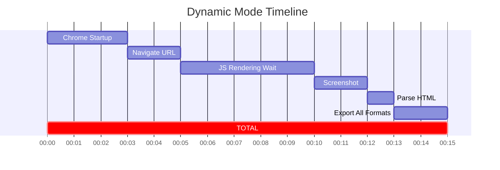

---

## 📦 Data Structure Transformations

### Input: Raw HTML

```html
<!DOCTYPE html>
<html>
<head><title>Example Page</title></head>
<body>
<h1>Main Title</h1>
<p>Some text here</p>
<a href="https://link.com">Click Me</a>

</body>
</html>
```

### After Parsing

```python
{
    "title": "Example Page",
    "headings": ["Main Title"],
    "paragraphs": ["Some text here"],
    "links": ["https://link.com"],
    "images": ["image.jpg"]
}
```

### After Export to JSON

```json
{
  "title": "Example Page",
  "headings": ["Main Title"],
  "paragraphs": ["Some text here"],
  "links": ["https://link.com"],
  "images": ["image.jpg"]
}
```

### After Export to Excel

```text
| title        | headings    | paragraphs      | links              | images   |
|--------------|-------------|-----------------|--------------------|----------|
| Example Page | Main Title  | Some text here  | https://link.com   | image.jpg|
```

---

## 🎯 Use Case Workflows

### Use Case 1: Content Research

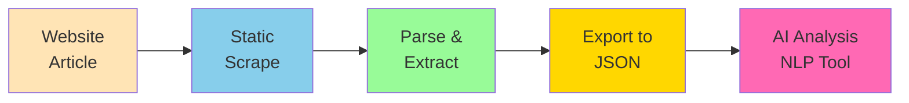

### Use Case 2: Price Monitoring


### Use Case 3: SEO Audit


---

## 🛡️ Security & Error Recovery

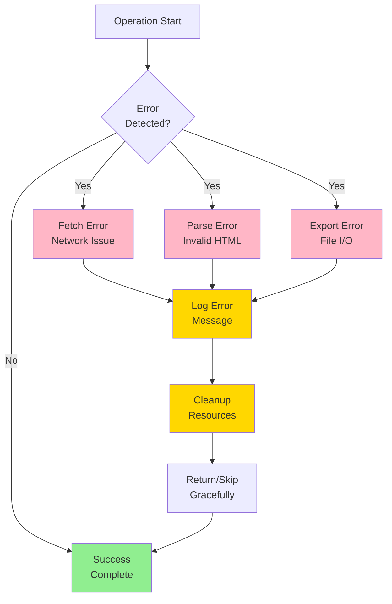

---

## 📋 Quick Reference: Flow Direction

```text
User Input
    ↓
main.py (orchestration)
    ↓
fetcher.py (get HTML)
    ├─ requests (static)
    └─ selenium (dynamic)
    ↓
parser.py (extract data)
    └─ BeautifulSoup
    ↓
exporter.py (6 formats)
    ├─ Excel
    ├─ JSON
    ├─ PDF
    ├─ Text
    ├─ HTML
    └─ Screenshot
    ↓
output/ (all files)
    ↓
User Retrieval
```

---

**Diagrams Version**: 1.0  
**Created**: April 2026  
**Tool**: Mermaid.js
